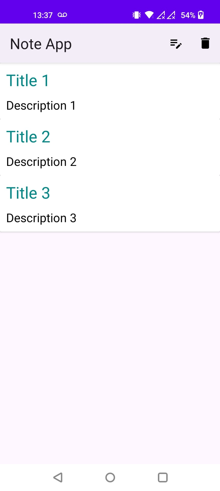
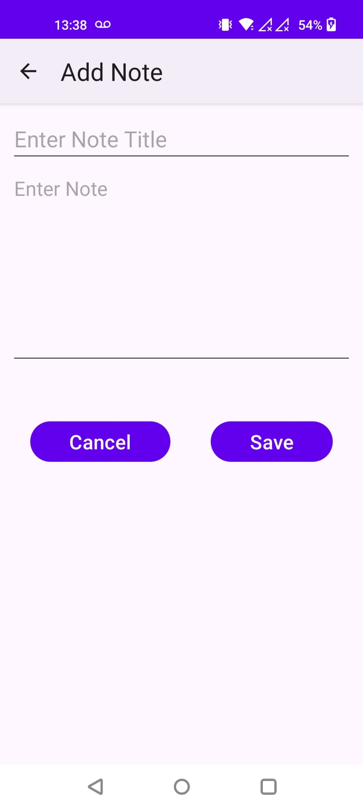
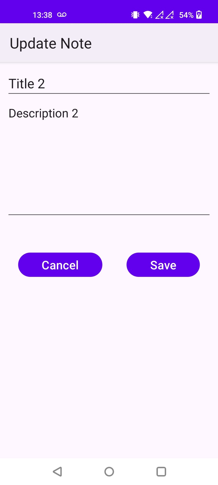
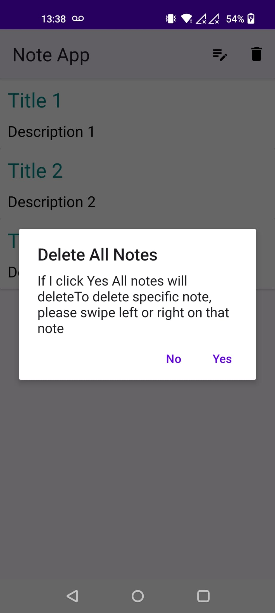

# Note App
## Introduction
The Note App simplifies the process of taking, managing, and organizing notes on Android devices. This repository contains the source code for the app, providing users with a convenient platform to create, edit, delete, and view notes effortlessly.

## Features
Note Creation: Easily create new notes with titles and content.
Note Editing: Modify existing notes to update information or add additional content.
Note Deletion: Remove unwanted notes from the app.
Note Listing: Display a list of all notes for quick access and management.

## Screenshots

       
  

 

## Getting Started
### Prerequisites
- Android Studio 2020.3.1 (Arctic Fox) or newer.
- Kotlin plugin installed.
- Minimum Android SDK version 24.
## Installation
**1.Clone this repository:**

```
git clone https://github.com/yourgithub/note-app.git
```

**2.Open the project in Android Studio.**

**3.Sync Gradle and build the project.**

## Using the App
**1.Run the App:**

Launch the Note App on your Android device or emulator.

**2.Create a New Note:**

Tap on the "New Note" button to start creating a new note. Enter the title and content for your note, then save it.

**3.Edit a Note:**

Tap on an existing note to open it for editing. Update the title or content as needed, then save your changes.

**4.Delete a Note:**

Long-press on a note to reveal options for deleting it. Confirm deletion to remove the note from the app.


## Contributing
Contributions to the Note App project are highly appreciated! Feel free to submit pull requests with improvements, bug fixes, or new features. For guidelines on contributing, please refer to our Contributing Guide in the repository.

## License
This project is licensed under the MIT License - see the LICENSE file for details.

Feel free to customize this README further to match your specific app details and requirements.
